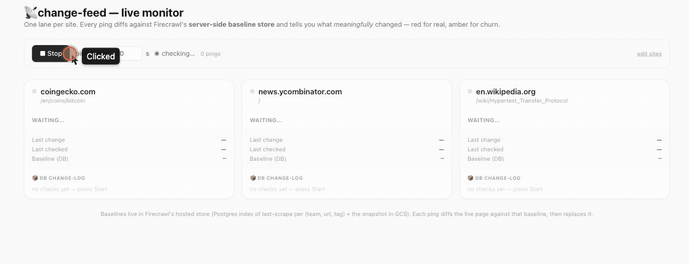

# change-feed — RSS for anything 📡

Turn **any webpage into a change-feed** — even the ~90% of the web with no RSS. Point it at a pricing
page, a Terms of Service, a competitor's changelog, a docs page, a job board. When something changes,
an LLM tells you **what meaningfully changed and why it matters** — not a raw text diff.

Runs on Firecrawl's **`/v2/monitor`** endpoint — the productized change-monitoring API (scheduling,
diff storage, and the "did this meaningfully change?" judge, all server-side). The original
`changeTracking` primitive it's built on is still here too, behind `--primitive`, powering the live
sync dashboard.

## See it live



Three real public pages, monitored on an interval: a **price page → 🔴** (caught a real
`$74,092 → $74,081` move), **Hacker News → 🟡** (vote-count churn, correctly muted as noise), a
**Wikipedia article → ⚪** (stable). Each lane shows the server baseline timestamp it diffed against and
the credits the ping cost.

## Two layers: the primitive and the product

Firecrawl exposes change-detection at two levels, and this example uses the right one for each job:

- **`changeTracking`** (the primitive) — a *synchronous* scrape format: "diff this page against its
  stored baseline, right now, inline." One call, instant result. Perfect for an **interactive
  dashboard** you watch live. This is the v1 path (`watch.ts`, `--primitive`).
- **`/v2/monitor`** (the product, shipped 2026-05) — *productizes* exactly that pattern: it schedules
  checks, stores the diff artifacts, runs the judge **server-side**, and keeps a check history. The
  right tool for **ongoing monitoring** — which is what a change-feed is. This is the default path
  (`monitor.ts`).

So the CLI became a **thin client over `/monitor`** — create a monitor, trigger an on-demand check
(`/run`), read the per-URL results — and we deleted the hand-rolled poll loop, concurrency pool, and
baseline bookkeeping. The judge that decides 🔴-vs-🟡 now lives on the server, not in our code.

```
your watchlist ──► POST /v2/monitor                 (create once; judge enabled)
                ──► POST /v2/monitor/:id/run         (on-demand check)
                ──► GET  /v2/monitor/:id/checks/:cid  (per-URL pages, server-judged)
                              ▼
   feed item: { status: new|changed|same|removed, summary: "Price rose $20 → $29", significant, diff }
```

## Run it

```bash
pnpm install
export FIRECRAWL_API_KEY=fc-...          # a CLOUD key — changeTracking is hosted

pnpm watch https://openai.com/pricing https://news.ycombinator.com
#   creates a monitor + runs a check → everything is NEW (baselines set). Prints the monitor id.
pnpm watch --monitor=<id> --diff
#   reuse that monitor later → CHANGED items, each server-judged, with the diff

pnpm watch --file=watchlist.txt           # one URL per line
pnpm watch <urls> --only-significant       # mute the 🟡 trivial churn, show only real changes
pnpm watch <urls> --primitive              # v1 path: drive changeTracking directly (sync, stateless)
```

Every run prints what it cost — `… · 5 credits used · 955 remaining` — so it never quietly burns your
quota. (The LLM summary only fires on a *changed* page, so low-churn pages like pricing/terms are ~free.)

## See it catch a real change

Point it at a page you control, change it, and watch it get caught:

```bash
pnpm watch https://example.com/pricing          # 1. baseline → 🆕 NEW
#    ... edit the page: raise the Pro plan $20 → $29 ...
pnpm watch https://example.com/pricing --diff    # 2. re-check
```
```
🔴  CHANGED  https://example.com/pricing
    The pricing for the Pro plan changed from $20 to $29 per month.
    @@ -21,12 +21,12 @@
    -$20 / month — unlimited projects ...
    +$29 / month — unlimited projects ...

— 1 changed (1 significant) · 1 watched · 1 scrapes · 1 change-summaries · 5 credits used · 945 remaining —
```

It flagged the **price** as significant and muted the surrounding timestamp churn — that's the point:
*meaningful* changes, not raw diffs.

## Live monitor (the dashboard above)

```bash
export FIRECRAWL_API_KEY=fc-...
pnpm dev          # → http://localhost:5173
```

One **swimlane per site**. Press **Start** and it pings every *N* seconds; each lane shows its current
status (🔴 real / 🟡 minor / ⚪ none / 🆕 new), **Last change**, **Last checked**, the **Baseline (DB)**
timestamp it's diffing against (Firecrawl's server-side store, surfaced via `previousScrapeAt`), and a
running **change-log**. The control bar shows the live credit cost per ping. Your key stays
**server-side** (a tiny `/api/check` route holds it) — the browser never sees it.

Schedule the CLI (cron / GitHub Action) to get a recurring "what changed across my watchlist" digest.

## How it works (the code)

- `src/monitor.ts` — **the default path.** A thin client over `/v2/monitor`: `createFeedMonitor` →
  `runMonitorCheck` (trigger + poll) → `pageToFeedItem`. The `MonitorClient` is injected, so the
  mapping/poll logic is unit-tested offline; the real one is a small fetch wrapper. The server judge's
  verdict is normalized defensively into `{ summary, significant }`.
- `src/watch.ts` — **the v1 primitive path** (`--primitive`, and the live dashboard): `watchUrls(urls,
  { scrape })` maps each URL's synchronous `changeTracking` result into a feed item. Per-URL isolation;
  pure + injected scrape fn. The significance policy is one externalized, tunable prompt (reused as the
  monitor's server-side `goal`).
- `src/format.ts` / `src/stats.ts` / `src/errors.ts` — terminal rendering, run stats, teaching errors.
- `src/cli.ts` — picks the engine (`/monitor` by default, `--primitive` for changeTracking) and prints
  the feed.
- `src/web/App.tsx` + `vite.config.ts` — the swimlane dashboard (on the sync primitive) and the
  key-safe `/api/check` route.

```bash
pnpm test        # 33 tests, no network (injected clients) — 13 cover the /monitor path
```

## Notes

- **Cloud only.** Both `/monitor` and `changeTracking` are hosted (baseline store + server-side
  judge); neither runs on a bare self-host. Point at `api.firecrawl.dev`.
- The `/monitor` path needs a `goal`/`judgeEnabled` for the server judge; we pass the same
  signal-vs-noise policy the primitive used as a prompt. First check on a fresh monitor is all `NEW`.
- Use a `tag` (per-URL) if you want multiple independent watch-streams on the same page.
